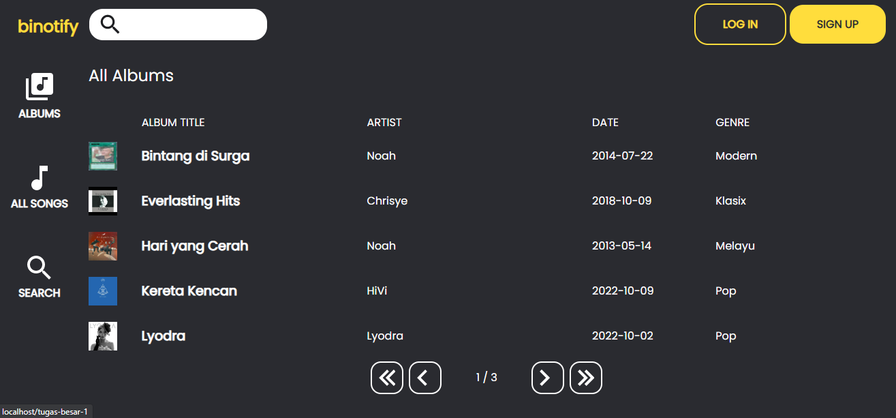
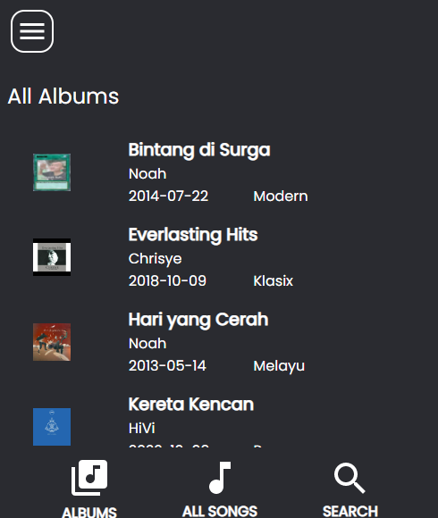
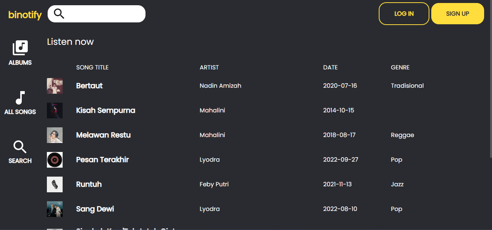
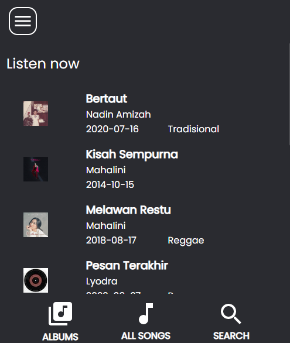
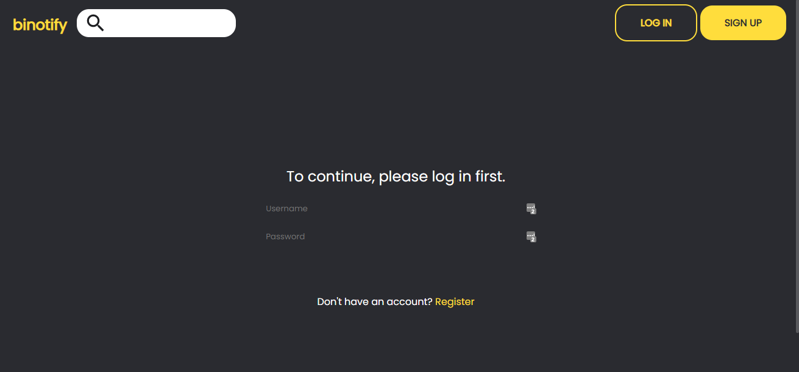
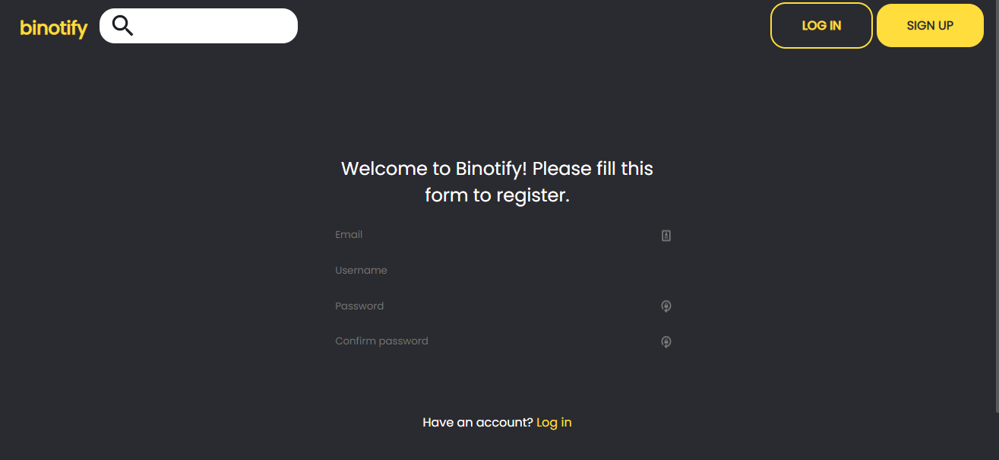
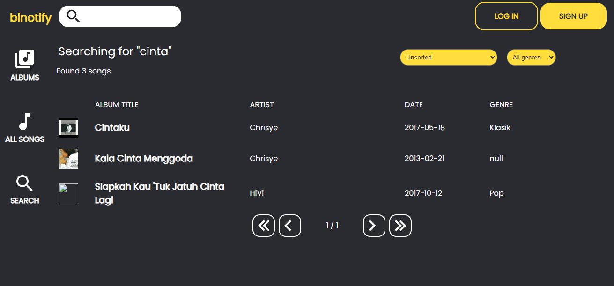

# binotify

Dibuat oleh:
  * Diky Restu Maulana (13520017)
  * Alifia Rahmah (13520122)
  * Andika Naufal Hilmy (13520098)

## Deskripsi Aplikasi Web
Aplikasi **binotify** dibuat untuk memenuhi tugas mata kuliah Pengembangan Aplikasi Berbasis Web. **binotify** adalah aplikasi musik berbasis _web_ yang dapat memutar musik secara _streaming_ dari _server_ ke _client_. Aplikasi ini dibuat dengan menggunakan konsep _Monolithic PHP & Vanilla Web Application_. Beberapa fitur yang terdapat pada aplikasi ini adalah:

  * _Login_ dan _Register_ user
  * Menampilkan detail album dan lagu di dalamnya
  * Menampilkan detail lagu
  * Memutar lagu
  * _Search_, _sort_, dan _filter_ lagu
  * _Logout_

## Daftar _requirements_
  * MySQL
  * PHP
  * Apache

**Note**: Requirement ini bisa dipaketkan dalam bentuk XAMPP
## Cara Instalasi
  1. Download atau clone repository ini
  2. Buat database baru dengan nama `binotify`
  3. Import file `binotify.sql` ke database `binotify`
  4. Pindahkan folder `binotify` ke folder `htdocs` pada XAMPP
  5. Jalankan XAMPP
  6. Buka browser dan ketikkan `localhost/tugas-besar-1` pada _address bar_
  7. Aplikasi siap digunakan

## Cara menjalankan _server_
  1. Jalankan XAMPP
  2. Buka browser dan ketikkan `localhost/tugas-besar-1` pada _address bar_
  3. Aplikasi siap digunakan

## _Screenshots_

## Pembagian Tugas

### Server Side
  * Login: 13520098
  * Register: 13520098
  * Home: 13520122
  * Daftar Album: 13520122
  * Search, Sort, Filter: 13510122
  * Detail Lagu: 13520017
  * Detail Album: 13520017
  * Tambah Album dan Lagu: 13520017
  * Daftar User: 13520098
### Client Side
  